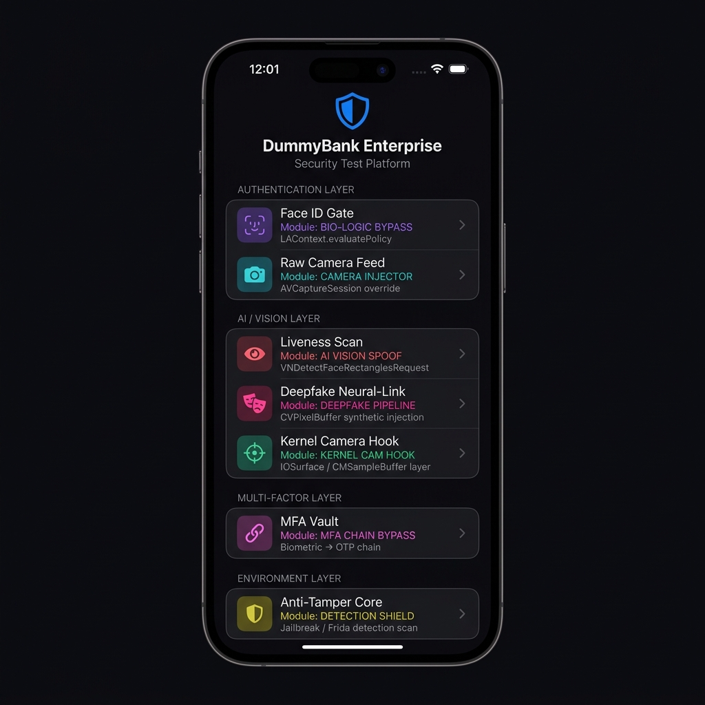
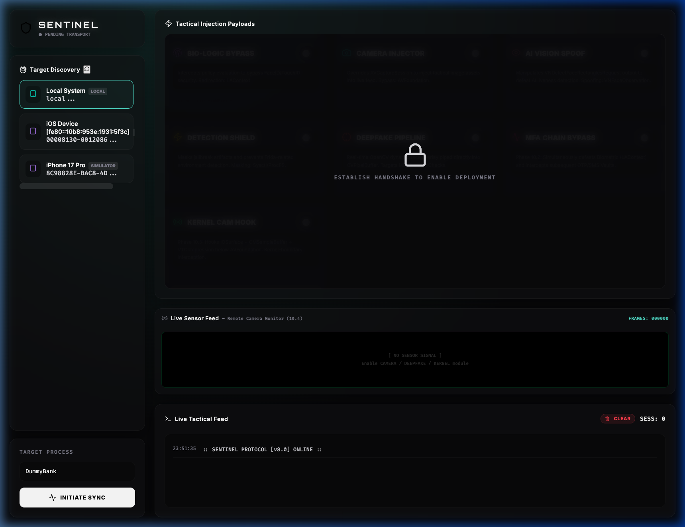

<div align="center">

```
███████╗███████╗███╗   ██╗████████╗██╗███╗   ██╗███████╗██╗
██╔════╝██╔════╝████╗  ██║╚══██╔══╝██║████╗  ██║██╔════╝██║
███████╗█████╗  ██╔██╗ ██║   ██║   ██║██╔██╗ ██║█████╗  ██║
╚════██║██╔══╝  ██║╚██╗██║   ██║   ██║██║╚██╗██║██╔══╝  ██║
███████║███████╗██║ ╚████║   ██║   ██║██║ ╚████║███████╗███████╗
╚══════╝╚══════╝╚═╝  ╚═══╝   ╚═╝   ╚═╝╚═╝  ╚═══╝╚══════╝╚══════╝
                         H O O K
```

<h3>Advanced Dynamic Instrumentation Framework for Mobile Security Research</h3>
<h4>Biometric · Camera · AI/ML · Anti-Tamper · MFA · Kernel-Level Hooking</h4>

<br>

<section align="center">
  
  
  <h4><b>İSTİNYE ÜNİVERSİTESİ — BİLİŞİM GÜVENLİĞİ TEKNOLOJİSİ</b></h4>
  <h5>Academic Security Research Project</h5>
  <p>
    <b>Student:</b> <a href="https://github.com/Kadiraricii">Kadir Arıcı</a><br>
    <b>Advisor:</b> <a href="https://github.com/keyvanarasteh">Keyvan Arasteh</a>
  </p>
</section>

<br>

---

[](https://github.com/Kadiraricii/Sentinel_Hook/stargazers)
[](https://github.com/Kadiraricii/Sentinel_Hook/network/members)
[](./DISCLAIMER.md)

[](https://frida.re)
[](https://developer.apple.com)
[](https://swift.org)
[](https://www.rust-lang.org)
[](https://react.dev)

</div>

---

## 📑 Table of Contents

- [Demo](#-demo)
- [Overview](#-overview)
- [Architecture](#-architecture)
- [Injection Modules](#-injection-modules)
- [DummyBank Test Target](#-dummybank-test-target-a–g)
- [Project Structure](#-project-structure)
- [Quick Start](#-quick-start)
- [Operational Procedure](#-operational-procedure)
- [Roadmap](#-roadmap)
- [Legal Notice](#️-legal-notice)

---

## 🎬 Demo

### Full Project Walkthrough

> **Video:** [`demo/project-demo.mov`](./demo/project-demo.mov) — Complete end-to-end demo (recorded by project author)  
> **Environment:** iOS 17 Simulator · Frida 17.x · Rust Backend · React Tactical Dashboard

The demo covers the full Sentinel Hook workflow:
- Rust backend startup and WebSocket server initialization
- Dashboard device discovery (iPhone 17 Pro Simulator detected via `frida-core`)
- Live injection of all 7 modules (BIO-LOGIC → CAMERA → VISION → DETECTION SHIELD → MFA CHAIN → DEEPFAKE → KERNEL CAM)
- DummyBank Targets A–G: each button triggering its corresponding Frida hook
- SYSTEM COMPROMISED screen for successful bypasses
- Live Sensor Feed (Phase 10.4) activating on camera-related modules

### Dashboard Preview





### What the Demo Shows

| Segment | Content |
|---|---|
| **Build** | Rust backend compiled and listening on `ws://127.0.0.1:8000` |
| **Device Discovery** | iPhone 17 Pro Simulator detected via `frida-core` |
| **7 Injection Modules** | BIO-LOGIC · CAMERA · AI VISION · DETECTION SHIELD · MFA CHAIN · DEEPFAKE · KERNEL CAM |
| **DummyBank Targets** | A–G buttons each mapped to one injection module |
| **Bypass Confirmation** | `SYSTEM COMPROMISED` screen on successful injection |
| **Live Sensor Feed** | Phase 10.4 remote camera monitor with animated scan-line |
| **MFA Chain Demo** | Wrong OTP rejected → injection active → any code bypasses both gates |

### Running It Yourself

```bash
# 1. Start Rust backend
cd sentinel-rust && source ../.venv/bin/activate && cargo run

# 2. Start dashboard
cd web_ui && npm run dev   # → http://localhost:5173

# 3. Build DummyBank in Xcode (iOS 17 Simulator) → ⌘R
```

Then in the dashboard: **Scan Devices → Select Simulator → Initiate Sync → Toggle Module → Tap Target in App**x

---

## 🎯 Overview

**Sentinel Hook** is an academic dynamic instrumentation framework built on top of [Frida](https://frida.re) for researching and demonstrating iOS biometric and multi-factor authentication bypass techniques. It provides a full-stack attack simulation environment composed of:

| Component | Technology | Role |
|---|---|---|
| **Frida Hooks** | JavaScript | Runtime method interception |
| **Backend** | Rust (Axum + WebSocket) | Injection orchestration & log streaming |
| **Dashboard** | React + Vite | Tactical control panel with live feed |
| **Test Target** | Swift (DummyBank iOS) | Simulated bank app with A–G attack surfaces |

> ⚠️ **For academic demonstration only.** See [DISCLAIMER.md](./DISCLAIMER.md).

---

## 🛰️ Architecture

```
┌─────────────────────┐        WebSocket        ┌──────────────────────┐
│   Sentinel Dashboard │◄──────────────────────►│   Rust Backend        │
│   (React / Vite)    │    ws://127.0.0.1:8000  │   (Axum + Tokio)      │
└─────────────────────┘                         └──────────┬───────────┘
                                                           │ frida-core
                                                           ▼
                                                ┌──────────────────────┐
                                                │   Frida Runtime       │
                                                │   (JS Hook Engine)    │
                                                └──────────┬───────────┘
                                                           │ ObjC / C interop
                                                           ▼
                                                ┌──────────────────────┐
                                                │   DummyBank (iOS)     │
                                                │   Target A – G        │
                                                └──────────────────────┘
```

**Control flow:**
1. Dashboard selects a device and target process
2. Rust backend spawns Frida and loads the appropriate JS payload(s)
3. Frida intercepts ObjC/C methods in the iOS process at runtime
4. Swift `@objc dynamic` bridge methods are called to update UI state
5. Results stream back over WebSocket to the dashboard's live terminal

---

## 💉 Injection Modules

Seven independent injection modules can be toggled as switches in the dashboard:

| # | Module ID | Color | Hook Layer | What It Does |
|---|---|---|---|---|
| 1 | `biometrics` | 🟣 Purple | `LAContext.evaluatePolicy` | Forces Face ID / Touch ID to return `success=true` |
| 2 | `camera` | 🔵 Teal | `AVCaptureSession` + `simulateFrameTrigger` | Injects a synthetic image frame into the live camera pipeline |
| 3 | `vision` | 🩷 Pink | `VNDetectFaceRectanglesRequest.results` | Replaces AI liveness detection results with a fake `VNFaceObservation` |
| 4 | `security` | 🟡 Yellow | `open()` + DYLD scan | Masks Frida agent presence and jailbreak file system artifacts |
| 5 | `mfachain` | 🔴 Magenta | `LAContext` + `MFAAuthManager.verifyOTP` | Phase 10.2: chains biometric bypass with OTP god-key substitution |
| 6 | `deepfake` | 🔴 Red | `CVPixelBuffer` | Injects synthetic face frames into the video buffer stream |
| 7 | `kernelcam` | 🟢 Green | `IOSurface` → `CMSampleBuffer` → `VTCompressionSession` | Phase 10.3: hooks the camera pipeline below AVFoundation at the kernel boundary |

### Frida–Swift Bridge

Each module calls `@objc dynamic` sentinel methods on live Swift instances found via `ObjC.chooseSync()`:

```
sentinelCameraBypass()  → CameraManager.isCameraAuthenticated = true
sentinelVisionBypass()  → CameraManager.aiFaceDetected = true
sentinelKernelBypass()  → CameraManager.isCameraAuthenticated = true
sentinelSecurityBypass()→ SecurityCheckManager.sentinelMaskActive = true
```

This design ensures that when a Frida hook fires, the SwiftUI view automatically navigates to the **SYSTEM COMPROMISED** screen without any additional polling or timers.

---

## 📱 DummyBank Test Target (A–G)

DummyBank is a purpose-built iOS application with seven distinct attack surfaces, each mapped to one Sentinel injection module:

| Target | Button | Module | Attack Surface | Expected Bypass Behavior |
|---|---|---|---|---|
| A | Face ID Gate | `biometrics` | `LAContext.evaluatePolicy` | Screen → SYSTEM COMPROMISED |
| B | Raw Camera Feed | `camera` | `AVCaptureSession` | `isCameraAuthenticated = true` |
| C | Liveness Scan | `vision` | `VNDetectFaceRectanglesRequest` | AI liveness defeated |
| D | Anti-Tamper Core | `security` | DYLD Frida scan | Frida shown as MASKED |
| E | MFA Vault | `mfachain` | Biometric + OTP chain | Any OTP bypasses both gates |
| F | Deepfake Neural-Link | `deepfake` | `CVPixelBuffer` | Synthetic feed injected |
| G | Kernel Camera Hook | `kernelcam` | `IOSurface` / `CMSampleBuffer` | Kernel boundary breached |

---

## 📂 Project Structure

```
Sentinel_Hook/
├── src/
│   └── hooks/
│       ├── 01_biometrics/          # LAContext bypass
│       │   └── local_auth_bypass.js
│       ├── 02_camera/              # AVCaptureSession override
│       │   ├── camera_bypass.js
│       │   └── video_replayer.js
│       ├── 03_ml_vision/           # VNDetectFaceRectangles + OpenCV
│       │   ├── vision_bypass.js
│       │   └── opencv_bypass.js
│       ├── 04_anti_tamper/         # Frida detection masking
│       │   └── frida_detection_bypass.js
│       ├── 05_mfa/                 # Phase 10.2 MFA chain
│       │   └── mfa_chain_bypass.js
│       └── advanced/               # Phase 10.3 kernel hooks + deepfake
│           ├── kernel_camera_hook.js
│           └── realtime_deepfake_hook.js
├── sentinel-rust/                  # Rust backend (Axum WebSocket server)
│   └── src/main.rs
├── web_ui/                         # React tactical dashboard
│   └── src/
│       ├── App.jsx
│       └── index.css
├── tests/
│   └── DummyBank/                  # Test target iOS app
│       ├── ContentView.swift       # A–G target state machine
│       ├── BiometricAuthManager.swift
│       ├── CameraManager.swift
│       ├── MFAAuthManager.swift
│       └── SecurityCheckManager.swift
├── docs/
│   ├── ARCHITECTURE.md
│   ├── HOOK_REFERENCE.md
│   ├── QUICKSTART.md
│   ├── TROUBLESHOOTING.md
│   └── research/
│       ├── biometric_forgery.md
│       ├── camera_hijacking.md
│       └── cloaking_stratagem.md
├── inject_hooks.py                 # Module bundler & PID manager
├── README.md
├── ROADMAP.md
├── CHANGELOG.md
└── DISCLAIMER.md
```

---

## 🚀 Quick Start

### Prerequisites

| Tool | Version | Purpose |
|---|---|---|
| Frida CLI | ≥ 17.0 | Dynamic instrumentation |
| Rust + Cargo | ≥ 1.77 | Backend server |
| Node.js | ≥ 18 | Dashboard dev server |
| Python | ≥ 3.12 | Hook bundler |
| Xcode | ≥ 15 | DummyBank build & simulator |

### 1. Start the Rust Backend

```bash
cd sentinel-rust
source ../.venv/bin/activate
cargo run
# → Listening on ws://127.0.0.1:8000
```

### 2. Start the Dashboard

```bash
cd web_ui
npm install
npm run dev
# → http://localhost:5173
```

### 3. Build & Run DummyBank

Open `tests/DummyBank/DummyBank.xcodeproj` in Xcode, select an iOS 17+ Simulator, and press **Run** (⌘R).

### 4. Inject a Module

1. Open the dashboard at `http://localhost:5173`
2. Click **Scan Devices** — your simulator will appear
3. Enter `DummyBank` as the target process
4. Click **Initiate Sync**
5. Toggle any injection switch (e.g. **BIO-LOGIC BYPASS**)
6. In the DummyBank app, tap the corresponding target button (e.g. **Target A: Face ID Gate**)
7. Observe bypass confirmation in both the app and the dashboard terminal

---

## 🕹️ Operational Procedure

### Module → Target Mapping

```
Dashboard Switch           DummyBank Button
─────────────────────────────────────────────
BIO-LOGIC BYPASS      →   Target A: Face ID Gate
CAMERA INJECTOR       →   Target B: Raw Camera Feed
AI VISION SPOOF       →   Target C: Liveness Scan
DETECTION SHIELD      →   Target D: Anti-Tamper Core
MFA CHAIN BYPASS      →   Target E: MFA Vault (Biometric + OTP)
DEEPFAKE PIPELINE     →   Target F: Deepfake Neural-Link
KERNEL CAM HOOK       →   Target G: Kernel Camera Hook
```

### MFA Chain Demo (Target E)

1. Press **Target E** (without injection) → OTP screen appears
2. Type any wrong code → `❌ Wrong code — Inject MFA CHAIN to mask`
3. Enable **MFA CHAIN BYPASS** in dashboard
4. Press **Target E** again → Frida bypasses biometric automatically
5. OTP screen shows — type any 6 digits → Frida replaces with `SENTINEL_OVERRIDE`
6. **SYSTEM COMPROMISED** screen appears

### Live Sensor Feed (Phase 10.4)

The dashboard includes a **Live Sensor Feed** panel. When CAMERA, DEEPFAKE, or KERNEL CAM modules are active, the panel shows an animated scan-line viewport with real-time frame metadata received via WebSocket `[FRAME:LAYER:timestamp:STATUS]` messages.

---

## 🗺️ Roadmap

See [ROADMAP.md](./ROADMAP.md) for the complete phased roadmap. Summary:

| Phase | Description | Status |
|---|---|---|
| 1–5 | Core biometric, camera, and vision hooks | ✅ Complete |
| 6–8 | Anti-tamper, deepfake, orchestration | ✅ Complete |
| 9 | Rust backend + React dashboard | ✅ Complete |
| 10.1 | Pattern lock & combo auth bypass | ✅ Complete |
| 10.2 | MFA chain bypass (Biometric + OTP) | ✅ Complete |
| 10.3 | Kernel-level camera hook (IOSurface layer) | ✅ Complete |
| 10.4 | Remote control panel + live sensor feed | ✅ Complete |
| 10.5 | AI-assisted target analysis | 🔄 In Progress |

---

## ⚖️ Legal Notice

This project is developed **exclusively for academic and educational purposes** as part of a university security research course. All techniques demonstrated herein are performed against purpose-built test applications in controlled, isolated environments.

**Unauthorized use of these techniques against production applications or real users is illegal under applicable computer fraud and abuse laws.** The author assumes no liability for misuse.

See [DISCLAIMER.md](./DISCLAIMER.md) for the full legal notice.

---

<div align="center">
  <sub>Built with 🔬 for academic security research · İstinye Üniversitesi · 2025–2026</sub>
</div>
