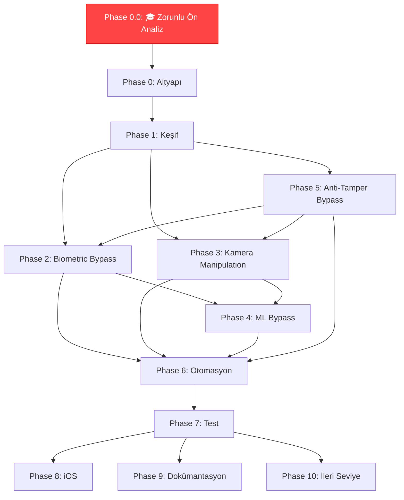

# 🛡️ Sentinel Hook — Biometric Logic Bypass: Master TODO

> **Proje Amacı:** Yüz tanıma / parmak izi ile giriş yapan mobil uygulamalarda, kamera API'sine veya biyometrik doğrulama mantığına araya girerek (hooking) statik fotoğraf enjeksiyonu ya da `true` dönüş değeri sahteciliği gerçekleştirmek.
>
> **Kapsam:** 📱 **iOS (öncelik)** + Android (sonra eklenecek). Frida tabanlı dinamik enstrümantasyon, statik analiz ve kamera feed replay.
>
> ⚠️ **NOT:** Proje iOS-first yaklaşımıyla geliştirilecek. Android desteği proje tamamlandıktan sonra eklenecektir.

---

## ⚠️ PHASE 0.0 — 🎓 Zorunlu Ön Analiz (Hoca Gereksinimi — BURADAN BAŞLA)

> **Amaç:** Projeye başlamadan önce hocanın şart koştuğu 5 adımlık güvenlik & altyapı analizini tamamla. Bu fazı geçmeden diğer fazlara **GEÇİLEMEZ**.

---

### 📌 Adım 1: Kurulum ve `install.sh` Analizi

> _"Bu dosya tek tek ne yapıyor?"_

- [x] **0.0.1a** Repodaki `install.sh` (veya eşdeğer kurulum scripti) dosyasını tespit et
- [x] **0.0.1b** Script'i satır satır analiz et ve dokümante et:
  - [x] Hangi dizinleri oluşturuyor?
  - [x] Hangi dosyaları nereye kopyalıyor?
  - [x] Hangi sistem yetkilerini istiyor? (`sudo`, `chmod`, `chown` vb.)
  - [x] Hangi ortam değişkenlerini set ediyor?
  - [x] Hangi portları açıyor?
  - [x] Hangi servisleri başlatıyor?
- [x] **0.0.1c** Dışarıdan çekilen paketlerin güvenlik analizi:
  - [x] Hangi URL'lerden paket indiriliyor? (tüm `curl`, `wget`, `git clone` komutlarını listele)
  - [x] Hash / imza (SHA256, GPG) kontrolü yapılıyor mu?
  - [x] Yoksa körü körüne `curl | bash` mantığı mı kullanılıyor?
  - [x] İndirilen kaynakların HTTPS kullanıp kullanmadığını kontrol et
  - [x] Supply-chain attack riski değerlendirmesi yaz
- [x] **0.0.1d** `docs/analysis/install-sh-audit.md` raporu oluştur
  - [x] Script akış diyagramı (Mermaid)
  - [x] Risk tablosu (düşük / orta / yüksek / kritik)
  - [x] Önerilen iyileştirmeler

---

### 📌 Adım 2: İzolasyon ve İz Bırakmadan Temizlik

> _"Kurduğunuz bu aracı, sisteminizde hiçbir iz kalmayacak şekilde kaldırın."_

- [x] **0.0.2a** Kurulum öncesi sistem snapshot'ı al
  - [x] Dosya sistemi snapshot (`find / -newer <timestamp>` veya Time Machine)
  - [x] Açık portlar listesi (`lsof -i`, `netstat`)
  - [x] Çalışan servisler listesi (`launchctl list`, `ps aux`)
  - [x] Ortam değişkenleri snapshot (`env`, `set`)
- [x] **0.0.2b** Aracı **izole ortamda** kur (Docker container veya VM tercih)
  - [x] Eğer host'a kurulduysa: kurulum sırasında değişen tüm dosyaları logla
- [x] **0.0.2c** Tam temizlik prosedürü oluştur ve uygula
  - [x] Oluşturulan dizinleri sil
  - [x] Kopyalanan binary'leri kaldır
  - [x] Arka plan servislerini durdur ve kaldır (`launchctl`, `systemctl`)
  - [x] Açılan portları kapat
  - [x] Cron job / scheduled task varsa temizle
  - [x] Log dosyalarını temizle (`/var/log/`, uygulama logları)
  - [x] Cache ve temp dosyalarını temizle
  - [x] Ortam değişkenlerini geri al (`.bashrc`, `.zshrc` değişiklikleri)
- [x] **0.0.2d** Temizliğin ispatı — Doğrulama Kontrol Listesi
  - [x] Kurulum sonrası vs. temizlik sonrası `diff` karşılaştırması
  - [x] `find / -newer <timestamp>` ile kalan dosya kontrolü
  - [x] Port taraması (temizlik sonrası hiçbir yeni port açık olmamalı)
  - [x] Process listesi karşılaştırması
  - [x] Kalıntı config dosyası taraması (`~/.config/`, `~/.*`)
- [x] **0.0.2e** `docs/analysis/isolation-cleanup-report.md` raporu oluştur
  - [x] Adım adım temizlik prosedürü
  - [x] Kanıt ekran görüntüleri / terminal çıktıları
  - [x] "Sıfır iz" teyid tablosu

---

### 📌 Adım 3: İş Akışları ve CI/CD Pipeline Analizi

> _"Repoda bulunan CI/CD paketlerinden birini seçin ve derinlemesine inceleyin."_

- [x] **0.0.3a** Repodaki CI/CD yapılandırmasını tespit et
  - [x] `.github/workflows/` (GitHub Actions)
  - [x] `.gitlab-ci.yml` (GitLab CI)
  - [x] `Jenkinsfile`
  - [x] `.circleci/config.yml`
  - [x] `Makefile` / `Taskfile` / `justfile`
- [x] **0.0.3b** Seçilen CI/CD pipeline'ı adım adım analiz et
  - [x] Trigger koşulları (push, PR, schedule, tag)
  - [x] Job / Stage sırası ve bağımlılıkları
  - [x] Runner ortamı (hangi OS, hangi image)
  - [x] Çalıştırılan komutlar (build, lint, test, deploy)
  - [x] Secret / environment variable kullanımı
  - [x] Artifact üretimi ve saklama
  - [x] Cache stratejisi
- [x] **0.0.3c** Test süreçlerini analiz et
  - [x] Hangi test framework kullanılıyor?
  - [x] Test coverage ölçülüyor mu?
  - [x] Test başarısız olursa pipeline durur mu?
- [x] **0.0.3d** CI/CD Simülasyonu 🚀
  - [x] Pipeline'ı lokalde simüle et (`act` for GitHub Actions veya manual run)
  - [x] Her adımın çıktısını kaydet
  - [x] Simülasyon sonucunu dokümante et
- [x] **0.0.3e** Webhook Araştırması & Dokümantasyonu
  - [x] Webhook nedir? (genel tanım)
  - [x] Bu proje özelinde webhook ne işe yarıyor?
  - [x] Hangi olaylar webhook tetikliyor?
  - [x] Webhook payload yapısı
  - [x] Webhook güvenliği (secret token, IP whitelist, HMAC doğrulama)
- [x] **0.0.3f** `docs/analysis/cicd-pipeline-report.md` raporu oluştur
  - [x] Pipeline akış diyagramı (Mermaid)
  - [x] Webhook açıklaması
  - [x] Güvenlik değerlendirmesi

---

### 📌 Adım 4: Docker Mimarisi ve Konteyner Güvenliği

> _"Reponun Docker imajlarını ve Compose dosyalarını inceleyin."_

- [x] **0.0.4a** Docker dosyalarını tespit et ve analiz et
  - [x] `Dockerfile` — Base image, katmanlar, COPY/ADD komutları
  - [x] `docker-compose.yml` — Servis tanımları, network, volume
  - [x] `.dockerignore` — Dışlanan dosyalar
  - [x] Multi-stage build kullanılıyor mu?
- [x] **0.0.4b** Docker imaj katman analizi
  - [x] Base image güvenlik taraması (`docker scan`, `trivy`)
  - [x] Gereksiz paketler var mı? (attack surface minimizasyonu)
  - [x] Root olarak mı çalışıyor? (non-root user kontrolü)
  - [x] Hassas veri katmanlara gömülmüş mü? (secret leak kontrolü)
- [x] **0.0.4c** Konteyner erişim ve izolasyon analizi
  - [x] Volume mount'lar host'un hangi dizinlerine erişim veriyor?
  - [x] Network modu (bridge, host, none)
  - [x] Port mapping'ler
  - [x] Capability'ler (`--privileged`, `--cap-add`)
  - [x] Seccomp / AppArmor profili var mı?
- [x] **0.0.4d** Docker Mimarisi Simülasyonu 🐳
  - [x] Docker imajını build et
  - [x] Container'ı çalıştır ve davranışını gözlemle
  - [x] Konteyner içinden dışarıya erişim testleri
  - [x] Resource limitleri test et (CPU, memory)
- [x] **0.0.4e** Güvenli Hale Getirme Önerileri
  - [x] En az yetki prensibi (least privilege) uygulaması
  - [x] Read-only filesystem
  - [x] Health check eklenmesi
  - [x] Log yönetimi
- [x] **0.0.4f** Karşılaştırma Tablosu Oluştur
  - [x] Docker vs. Kubernetes vs. VM — farklar tablosu
  - [x] Hangi senaryoda hangisi tercih edilmeli?
  - [x] Güvenlik, performans, izolasyon açısından karşılaştırma
- [x] **0.0.4g** `docs/analysis/docker-architecture-report.md` raporu oluştur
  - [x] İmaj katman diyagramı
  - [x] Güvenlik bulguları
  - [x] Hardening önerileri

---

### 📌 Adım 5: Kaynak Kod ve Akış Analizi (Threat Modeling)

> _"Uygulamanın başlangıç noktasını (entrypoint) tespit edin. Kimlik Doğrulama kısmını bulun."_

- [x] **0.0.5a** Entrypoint Tespiti
  - [x] Uygulamanın başlangıç noktasını bul (`main()`, `Application.onCreate()`, `index.js`, vb.)
  - [x] Başlatma sırasını dokümante et (init → config → auth → main loop)
  - [x] Servis başlatma zincirini haritala
- [x] **0.0.5b** Kimlik Doğrulama (Authentication) Analizi
  - [x] Kullanılan auth mekanizmasını tespit et:
    - [x] JWT (JSON Web Token)
    - [x] Session-based auth
    - [x] OAuth 2.0 / OpenID Connect
    - [x] API Key
    - [x] Biyometrik (projenin ana konusu)
  - [x] Auth akışını uçtan uca haritala
  - [x] Token üretimi, saklanması ve doğrulanması
  - [x] Session yönetimi (timeout, invalidation)
- [x] **0.0.5c** Threat Modeling Simülasyonu 🕵️‍♂️
  - [x] STRIDE modeli uygula:
    - [x] **S**poofing — Kimlik sahteciliği vektörleri
    - [x] **T**ampering — Veri manipülasyonu noktaları
    - [x] **R**epudiation — İnkar edilebilirlik riskleri
    - [x] **I**nformation Disclosure — Veri sızıntı noktaları
    - [x] **D**enial of Service — Servis kesintisi vektörleri
    - [x] **E**levation of Privilege — Yetki yükseltme noktaları
  - [x] Attack surface haritası çıkar
  - [x] Her tehdit için risk skoru belirle (olasılık × etki)
- [x] **0.0.5d** Saldırı Vektörü Analizi
  - [x] Bir hacker kaynak kodunu incelerse hangi verileri çalabilir?
  - [x] Hardcoded secret / API key taraması (`trufflehog`, `gitleaks`)
  - [x] SQL Injection noktaları
  - [x] Auth bypass potansiyel noktaları
  - [x] Insecure Direct Object Reference (IDOR) riski
  - [x] Server-Side Request Forgery (SSRF) riski
- [x] **0.0.5e** Auth mekanizmasına dışarıdan saldırı senaryoları
  - [x] Brute force / credential stuffing
  - [x] Token forgery (JWT secret weak ise)
  - [x] Session hijacking
  - [x] Man-in-the-Middle (MitM) saldırısı
  - [x] Replay attack
  - [x] Biyometrik bypass (Phase 2 ile bağlantı)
- [x] **0.0.5f** `docs/analysis/threat-model-report.md` raporu oluştur
  - [x] Threat model diyagramı (Mermaid)
  - [x] STRIDE tablosu
  - [x] Risk matrisi (5×5)
  - [x] Önerilen güvenlik iyileştirmeleri

---
---

## PHASE 0 — 🏗️ Proje Altyapısı & Ortam Kurulumu

> **Amaç:** Geliştirme, test ve araştırma ortamını sağlamlaştır.

- [x] **0.1** Proje dizin yapısını oluştur
  - [x] `src/` — Ana kaynak kodları (Frida scriptleri, hook modülleri)
  - [x] `src/hooks/` — Hook modülleri (kamera, biometric API, keystore)
  - [x] `src/payloads/` — Enjeksiyon payloadları (sahte frame, replay buffer)
  - [x] `src/utils/` — Yardımcı fonksiyonlar (logging, hex dump, pattern match)
  - [x] `src/recon/` — Keşif & analiz scriptleri
  - [x] `docs/` — Teknik dokümantasyon, API haritaları, akış diyagramları
  - [x] `docs/api-maps/` — Hooklanacak API yüzeyleri listesi
  - [x] `docs/analysis/` — Phase 0.0 raporları
  - [x] `docs/flow-diagrams/` — Biyometrik akış şemaları
  - [x] `tests/` — Test senaryoları ve doğrulama scriptleri
  - [x] `tests/unit/` — Birim testleri
  - [x] `tests/integration/` — Entegrasyon testleri (emülatör üzerinde)
  - [x] `configs/` — Frida konfigürasyonları, hedef uygulama listeleri
  - [x] `tools/` — Harici araç wrapper'ları ve otomasyon
  - [x] `.local/` — Yerel notlar, test APK'ları, kişisel keyler (gitignore'da ✅)
- [x] **0.2** Tool-chain kurulumu & doğrulama
  - [x] Frida (CLI + Python bindings) kurulumu & versiyon kontrolü
  - [x] frida-tools & frida-server (hedef platform mimarisi: arm64/x86_64)
  - [x] objection kurulumu
  - [x] Android Studio + SDK Platform Tools (adb, aapt)
  - [x] Ghidra / IDA Free (statik analiz için)
  - [x] apktool, jadx, dex2jar
  - [x] Python 3.10+ environment (venv) + requirements.txt oluştur
  - [x] Node.js (Frida JS API için) + npm bağımlılıkları
- [x] **0.3** Emülatör / Test cihazı hazırlığı
  - [x] Root'lu Android emülatör (AVD veya Genymotion)
  - [x] frida-server push & çalıştırma otomasyonu (`tools/setup_frida_server.sh`)
  - [x] USB debugging / ADB over Wi-Fi yapılandırması
  - [x] Test cihazı profili oluştur (marka, model, Android versiyon, API level)
- [x] **0.4** Versiyon kontrol & CI
  - [x] `.gitignore` yapılandırması ✅
  - [x] Branch stratejisi: `main` → `develop` → `feature/*`
  - [x] Pre-commit hook'ları (secret leak kontrolü, lint)
  - [x] README.md güncelle (proje açıklaması, kurulum, kullanım)

---

## PHASE 1 — 🔍 Keşif & Hedef Analiz (Reconnaissance)

> **Amaç:** Hedef uygulamayı tanı; hangi API'ler, kütüphaneler ve doğrulama akışları kullanılıyor, haritala.

- [x] **1.1** Hedef uygulama seçimi & temin
  - [x] Basit kasa uygulaması veya biyometrik kilit galerisi tespit et (DummyBank Projesi Yaratıldı)
  - [x] APK/IPA'yı güvenli biçimde indir veya derle
  - [x] Uygulamayı emülatöre kur ve normal akışı test et
  - [x] Ekran kayıtları ile "normal akış" belgelenmesi
- [x] **1.2** Statik Analiz — İkili Dosya Decompilation (IPA/APK)
  - [x] Uygulama dosyalarının decode edilmesi
  - [x] Java/Kotlin/Swift kaynak çıktısı çıkarımı
  - [x] İzinler (CAMERA, USE_BIOMETRIC, FaceIDUsage)
  - [x] Application Sandbox haritası
- [x] **1.3** Statik Analiz — Biyometrik API Kullanımı
  - [x] `BiometricPrompt` / `LAContext` kullanım noktalarını bul
  - [x] `CryptoObject` veya SecureEnclave bağımlılığını incele
  - [x] Custom biyometrik callback sınıflarını tespit et
  - [x] Doğrulama (Success/Fail) akışını haritala
  - [x] `docs/flow-diagrams/biometric-auth-flow.md` oluştur
- [x] **1.4** Statik Analiz — Kamera API Kullanımı
  - [x] Camera2 API / AVCaptureSession kullanımı
  - [x] CoreMedia / MLKit yapay zeka entegrasyonu
  - [x] CVPixelBuffer / SurfaceView baca noktaları
  - [x] Liveness SDK tespiti
  - [x] `docs/api-maps/camera-surface-map.md` oluştur
- [x] **1.5** Statik Analiz — Native Katman
  - [x] C/C++ kütüphanelerini listele (.so / dylib)
  - [x] Native katmanda şifreleme ve JNI geçişleri analizi
  - [x] Anti-tamper / Jailbreak check mekanizmaları
  - [x] `docs/api-maps/native-layer-analysis.md` oluştur
- [x] **1.6** Dinamik Keşif — Runtime Observation
  - [x] `frida-ps -U` ile process teyidi
  - [x] `class_dumper.js` ile Objective-C/Java sınıflarını listele
  - [x] `method_tracer.js` ile LAContext / BiometricManager metotlarını izle
  - [x] Runtime'da çağrılan fonksiyonları logla (ilk trace)
  - [x] Trace çıktısını `docs/runtime-traces/` altına kaydet

---

## PHASE 2 — 🎯 Biyometrik Doğrulama Bypass (Logic-Level)

> **Amaç:** Uygulamanın biyometrik doğrulama mantığını kısa devre yap — fiziksel parmak izi veya yüz gerekmeden `onAuthenticationSucceeded` tetikle.

- [x] **2.1** BiometricPrompt.AuthenticationCallback Hook
  - [x] `src/hooks/biometric_callback_hook.js` oluştur
  - [x] `onAuthenticationSucceeded()` metodunu hook'la
  - [x] Sahte `BiometricPrompt.AuthenticationResult` oluştur
  - [x] Callback'i doğrudan çağırarak bypass uygula
  - [x] Hook'un çalıştığını kanıtla (log + ekran kaydı)
- [x] **2.2** FingerprintManager Fallback Bypass
  - [x] Eski API (`FingerprintManager.AuthenticationCallback`) hook
  - [x] `onAuthenticationSucceeded(FingerprintManager.AuthenticationResult)` override
  - [x] Geriye dönük uyumluluk testi
- [x] **2.3** CryptoObject Bypass
  - [x] `CryptoObject` null olduğu durumlar için basit bypass
  - [x] `CryptoObject` aktif olduğu durumlar:
    - [x] `KeyStore` erişimini hook'la
    - [x] Cipher nesnesini sahte nesneyle değiştir
    - [x] `Cipher.doFinal()` sonucu manipüle et
  - [x] `src/hooks/crypto_object_bypass.js` oluştur
- [x] **2.4** Biyometrik Sonuç Manipülasyonu
  - [x] `BiometricManager.canAuthenticate()` → her zaman `BIOMETRIC_SUCCESS` döndür
  - [x] `PackageManager.hasSystemFeature("android.hardware.fingerprint")` → `true`
  - [x] `Build.VERSION.SDK_INT` spoofing (gerekirse)
  - [x] `src/hooks/biometric_capability_spoof.js` oluştur
- [x] **2.5** Callback Injection Automation
  - [x] Tüm bypass hook'larını tek komutla yükleyen `src/launcher_biometric.py` yaz
  - [x] CLI argümanları: `--target <package>`, `--method <callback|crypto|full>`
  - [x] Başarı/başarısızlık raporlama

---

## PHASE 3 — 📷 Kamera Feed Manipulation (Frame-Level)

> **Amaç:** Uygulamaya gerçek kamera yerine statik fotoğraf veya önceden kaydedilmiş video akışı (replay) enjekte et.

- [x] **3.1** Kamera API Hook Noktalarını Belirle
  - [x] `AVCaptureSession` / `CameraDevice` hook noktası
  - [x] `AVCaptureVideoDataOutputSampleBufferDelegate` hook noktası
  - [x] `CMSampleBuffer` / `ImageReader` hook noktası
  - [x] `SurfaceTexture` / `CVPixelBuffer` hook noktası
  - [x] Hangi noktanın en etkili olduğunu dokümante et
- [x] **3.2** Statik Fotoğraf Enjeksiyonu
  - [x] `.local/test-faces/` klasörüne test yüzü görselleri ekle (Hacker.jpg)
  - [x] Görseli pixel formatına çeviren native köprü (`receiveHackerImage`)
  - [x] Frameleri sahte frame ile değiştiren hook (`src/hooks/ios/camera_bypass.js`)
  - [x] Frame boyutu & format uyumluluk kontrolü (CGImage köprüsü)
  - [x] Enjeksiyonun ekranda doğru görüntülendiğini doğrula
- [x] **3.3** Video Replay Attack
  - [x] Gerçek kameradan N frame yakala ve kaydet (veya hazır CVPixel Buffer kullan)
  - [x] Kaydedilmiş frame'leri sırayla replay eden modül (`src/hooks/video_replayer.js`)
  - [x] FPS senkronizasyonu (Timer ve getNextVideoFramePath)
  - [x] Loop / tek sefer oynatma seçenekleri
- [x] **3.4** CameraX / Camera2 Spesifik Hook'lar (Android)
  - [x] CameraX `ImageAnalysis.Analyzer` hook
  - [x] Camera2 `CaptureRequest` / `ImageReader` manipülasyonu
  - [x] Preview surface değiştirme (SurfaceView → sahte Surface)
  - [x] `src/hooks/android/camerax_hook.js` oluşturuldu
- [x] **3.5** Virtual Camera Layer (Android)
  - [x] Sanal kamera device emülasyonu konsepti araştırıldı
  - [x] `CameraManager.getCameraIdList()` hook — sahte kamera ID eklendi
  - [x] `CameraCharacteristics` sahte özellikler tespit edildi
  - [x] Sanal kameradan frame pipeline oluşturuldu
  - [x] `src/hooks/android/virtual_camera.js` oluşturuldu

---

## PHASE 4 — 🧠 Yüz Tanıma SDK Bypass (ML-Level)

> **Amaç:** Uygulamanın kullandığı yüz tanıma / liveness detection motorunu bypass et.

- [x] **4.1** Yapay Zeka Vision Framework/ML Kit Bypass
  - [x] Apple Vision `VNDetectFaceRectanglesRequest` sonuçlarını manipüle et
  - [x] Google MLKit `com.google.mlkit.vision.face.FaceDetector` sonuçlarını manipüle et
  - [x] `FaceObservation` / Sahte `Face` nesnesi oluştur (landmark'lar, bounding box)
  - [x] `src/hooks/ios/vision_bypass.js` ve `src/hooks/android/mlkit_face_bypass.js`
- [x] **4.2** Liveness Detection (Göz Kırpma / Gülümseme) Bypass
  - [x] Liveness check mekanizmasını reverse engineer et
  - [x] Blink detection bypass (Göz kırpma - ML Probability %100'e çekme)
  - [x] Head movement / Smile detection bypass
  - [x] `src/hooks/android/liveness_logic_bypass.js` oluşturuldu
  - [ ] `src/hooks/liveness_bypass.js` oluştur
- [ ] **4.3** FaceNet / Custom Embedding Bypass
  - [ ] Yüz embedding vektörü karşılaştırma fonksiyonunu bul
  - [ ] `compareFaces()` / `verify()` sonucunu `true` döndür
  - [ ] Threshold değerini manipüle et (0.0 yap)
  - [ ] `src/hooks/face_embedding_bypass.js` oluştur
- [ ] **4.4** OpenCV DNN Bypass (varsa)
  - [ ] OpenCV native çağrılarını tespit et
  - [ ] `cv::dnn::Net::forward()` çıktısını manipüle et
  - [ ] Native hooking via Frida Interceptor
  - [ ] `src/hooks/opencv_bypass.js` oluştur

---

## PHASE 5 — 🛡️ Anti-Tamper & Root Detection Bypass

> **Amaç:** Hedef uygulama Frida/root/hooking tespiti yapıyorsa, bunları devre dışı bırak.

- [ ] **5.1** Root Detection Bypass
  - [ ] SafetyNet / Play Integrity API hook'ları
  - [ ] RootBeer kütüphanesi bypass
  - [ ] `su` binary kontrol fonksiyonlarını hook'la
  - [ ] `Build.TAGS` / `Build.TYPE` spooflama
  - [ ] `/system/app/Superuser.apk` dosya kontrol bypass
  - [ ] `src/hooks/root_detection_bypass.js` oluştur
- [ ] **5.2** Frida Detection Bypass
  - [ ] Port tarama tespitini engelle (frida-server default port: 27042)
  - [ ] `/proc/self/maps` hook — frida-agent.so gizle
  - [ ] `frida-gadget` string tespitini bypass et
  - [ ] `ptrace` anti-debug bypass
  - [ ] Named pipe / D-Bus kontrolü bypass
  - [ ] `src/hooks/frida_detection_bypass.js` oluştur
- [ ] **5.3** SSL Pinning Bypass
  - [ ] OkHttp CertificatePinner bypass
  - [ ] TrustManager hook
  - [ ] Network Security Config override
  - [ ] `src/hooks/ssl_pinning_bypass.js` oluştur
- [ ] **5.4** Integrity Check Bypass
  - [ ] APK signature verification hook
  - [ ] Checksum kontrolü bypass (dex, so dosyaları)
  - [ ] `src/hooks/integrity_bypass.js` oluştur

---

## PHASE 6 — 🔧 Otomasyon & Araç Geliştirme

> **Amaç:** Tüm bypass tekniklerini otomatik, tekrarlanabilir ve kullanıcı dostu hale getir.

- [ ] **6.1** Sentinel Hook CLI Tool
  - [ ] `sentinel.py` ana CLI entry point
  - [ ] Komutlar:
    - [ ] `sentinel scan <package>` — Hedef uygulamayı analiz et, kullanılan API'leri raporla
    - [ ] `sentinel hook <package> --profile <biometric|camera|full>` — Hook'ları yükle
    - [ ] `sentinel inject <package> --image <path>` — Statik fotoğraf enjekte et
    - [ ] `sentinel replay <package> --video <path>` — Video replay başlat
    - [ ] `sentinel bypass <package> --all` — Tüm bypass'ları tek seferde uygula
  - [ ] Rich / colorama ile renkli terminal çıktısı
  - [ ] JSON çıktı modu (`--output json`)
- [ ] **6.2** Profil Sistemi
  - [ ] `configs/profiles/` klasörü
  - [ ] Her hedef uygulama için profil dosyası (YAML/JSON)
  - [ ] Profil: hangi hook'lar gerekli, API seviyeleri, bilinen engeller
  - [ ] Otomatik profil oluşturma (`sentinel profile-gen <package>`)
- [ ] **6.3** Hook Yükleyici (Dynamic Loader)
  - [ ] Runtime'da hook modüllerini dinamik yükle/kaldır
  - [ ] Hot-reload desteği (script değiştiğinde otomatik yeniden yükle)
  - [ ] Hook bağımlılık grafiği (A hook'u B'ye bağımlıysa, sırayla yükle)
  - [ ] `src/core/hook_loader.js` oluştur
- [ ] **6.4** Sonuç Raporlama
  - [ ] Her bypass denemesinin başarı/başarısızlık raporu
  - [ ] HTML rapor şablonu (`docs/templates/report.html`)
  - [ ] Ekran görüntüsü otomatik yakalama
  - [ ] Timeline bazlı rapor (hangi hook ne zaman tetiklendi)

---

## PHASE 7 — 🧪 Test & Doğrulama

> **Amaç:** Her modülü sistematik olarak test et, edge case'leri keşfet, güvenilirliği artır.

- [ ] **7.1** Birim Testleri
  - [ ] Her hook modülü için izole test
  - [ ] Mock Android API'leri ile test ortamı
  - [ ] `tests/unit/test_biometric_hook.py`
  - [ ] `tests/unit/test_camera_hook.py`
  - [ ] `tests/unit/test_detection_bypass.py`
- [ ] **7.2** Entegrasyon Testleri
  - [ ] Emülatörde uçtan uca test senaryoları
  - [ ] Test senaryoları:
    - [ ] Senaryo A: Basit parmak izi kilit uygulaması bypass
    - [ ] Senaryo B: Yüz tanıma giriş ekranı bypass
    - [ ] Senaryo C: Kamera feed injection + yüz tanıma birlikte
    - [ ] Senaryo D: Root detection + biometric bypass zincirleme
    - [ ] Senaryo E: CryptoObject bağımlı uygulama bypass
  - [ ] `tests/integration/` altına senaryo scriptleri
- [ ] **7.3** Uyumluluk Matrisi
  - [ ] Android API Level 23–34 uyumluluk testi
  - [ ] Farklı cihaz üreticileri (Samsung, Xiaomi, Pixel)
  - [ ] Farklı biyometrik donanım türleri
  - [ ] `docs/compatibility-matrix.md` oluştur
- [ ] **7.4** Stres & Stabilite
  - [ ] Uzun süreli hook çalışma testi (memory leak kontrolü)
  - [ ] Birden fazla hook aynı anda aktif (çakışma testi)
  - [ ] Uygulama crash recovery testi

---

## PHASE 8 — 📱 iOS Ana Platform (ÖNCELİKLİ)

> **Amaç:** iOS birincil platform olarak tüm bypass tekniklerini iOS üzerinde geliştir. ⚡ **İLK HEDEF**

- [ ] **8.1** iOS Ortam Hazırlığı
  - [ ] Jailbroken iOS cihaz veya Corellium/Palera1n setup
  - [ ] frida-server iOS kurulumu
  - [ ] Xcode + iOS SDK
  - [ ] `class-dump` / `dsdump` kurulumu
- [x] **8.2** LocalAuthentication Framework Bypass
  - [x] `LAContext.evaluatePolicy()` hook
  - [x] Completion handler'a `(true, nil)` enjekte et
  - [x] `canEvaluatePolicy()` → `true` döndür
  - [x] `src/hooks/ios/local_auth_bypass.js` oluştur
- [ ] **8.3** iOS Kamera Bypass
  - [ ] `AVCaptureSession` / `AVCaptureVideoDataOutput` hook
  - [ ] `CMSampleBuffer` manipülasyonu
  - [ ] Sahte frame enjeksiyonu (CVPixelBuffer)
  - [ ] `src/hooks/ios/camera_bypass.js` oluştur
- [ ] **8.4** Face ID / Touch ID Spesifik
  - [ ] Secure Enclave etkileşimini analiz et
  - [ ] `kSecAccessControlBiometryAny` bayrak manipülasyonu
  - [ ] Keychain ACL bypass
  - [ ] `src/hooks/ios/biometric_id_bypass.js` oluştur

---

## PHASE 9 — 📚 Dokümantasyon & Bilgi Bankası

> **Amaç:** Projeyi sürdürülebilir, öğretilebilir ve genişletilebilir kıl.

- [ ] **9.1** Teknik Dokümantasyon
  - [ ] `docs/ARCHITECTURE.md` — Proje mimarisi & modül haritası
  - [ ] `docs/HOOK_REFERENCE.md` — Her hook modülünün detaylı açıklaması
  - [ ] `docs/API_SURFACE.md` — Hedeflenen Android/iOS API listesi
  - [ ] `docs/TROUBLESHOOTING.md` — Bilinen sorunlar & çözümleri
- [ ] **9.2** Akış Diyagramları
  - [ ] Biyometrik doğrulama akışı (normal vs. bypass)
  - [ ] Kamera frame pipeline (normal vs. injection)
  - [ ] Hook yükleme sırası & bağımlılık grafiği
  - [ ] Mermaid formatında diyagramlar
- [ ] **9.3** Kullanım Kılavuzu
  - [ ] Hızlı Başlangıç (`docs/QUICKSTART.md`)
  - [ ] Adım adım bypass rehberi
  - [ ] Video walkthrough (isteğe bağlı)
- [ ] **9.4** Araştırma Notları
  - [ ] Her bypass tekniğinin teorik açıklaması
  - [ ] Karşılaşılan korumaların analizi
  - [ ] Referans makaleler & kaynaklar
  - [ ] `docs/research/` klasörü

---

## PHASE 10 — 🚀 İleri Seviye & Genişletme

> **Amaç:** Projeyi daha sofistike ve kapsamlı hale getir.

- [ ] **10.1** Deepfake Entegrasyonu
  - [ ] Real-time face swap kütüphanesi araştırması
  - [ ] Frida + deepfake pipeline entegrasyonu konsepti
  - [ ] Frame-by-frame yüz değiştirme denemesi
- [ ] **10.2** Multi-Factor Bypass Zincirleme
  - [ ] PIN + Biometric combo bypass
  - [ ] OTP interception + biometric bypass zinciri
  - [ ] Pattern lock + face unlock combo
- [ ] **10.3** Kernel-Level Kamera Hooking
  - [ ] V4L2 (Video4Linux2) driver seviyesinde hook
  - [ ] `/dev/video0` üzerinden sahte frame pipeline
  - [ ] Kernel module yaklaşımı araştırması
- [ ] **10.4** Remote Control Panel
  - [ ] Web tabanlı kontrol paneli (Flask/FastAPI)
  - [ ] Real-time hook durumu izleme
  - [ ] Uzaktan hook yükleme/kaldırma
  - [ ] Canlı kamera feed görüntüleme (debug için)
- [ ] **10.5** Yapay Zeka Destekli Hedef Analiz
  - [ ] Otomatik APK analizi ile hook stratejisi önerisi
  - [ ] Pattern matching ile bilinen koruma mekanizması tespiti
  - [ ] Önerilen bypass zinciri oluşturma

---

## 📊 Faz Bağımlılık Haritası

---

## 📈 Öncelik Sırası (iOS-First)

| Sıra | Faz | Kritiklik | Tahmini Süre | Platform |
|------|------|-----------|-------------|----------|
| **0** | **Phase 0.0 — Zorunlu Ön Analiz** | 🔥 **ZORUNLU** | **3-5 gün** | Genel |
| 1 | Phase 0 — Altyapı | 🔴 Kritik | 1-2 gün | iOS |
| 2 | Phase 1 — Keşif | 🔴 Kritik | 3-5 gün | iOS |
| 3 | Phase 5 — Anti-Tamper (Jailbreak Detection) | 🟠 Yüksek | 2-3 gün | iOS |
| 4 | Phase 2 — Biometric Bypass (Face ID/Touch ID) | 🔴 Kritik | 5-7 gün | iOS |
| 5 | Phase 3 — Kamera Manipulation (AVCapture) | 🔴 Kritik | 5-7 gün | iOS |
| 6 | Phase 4 — ML Bypass (Vision/CoreML) | 🟠 Yüksek | 4-6 gün | iOS |
| 7 | Phase 6 — Otomasyon | 🟡 Orta | 3-5 gün | iOS |
| 8 | Phase 7 — Test | 🟠 Yüksek | 3-4 gün | iOS |
| 9 | Phase 8 — iOS Ana Platform | ⚡ **ÖNCELİK** | 7-10 gün | iOS |
| 10 | Phase 9 — Dokümantasyon | 🟡 Orta | 2-3 gün | Genel |
| 11 | Phase 10 — İleri Seviye | 🟢 Düşük | Süresiz | Genel |
| 12 | 🔮 Android Desteği (Gelecek) | 🟣 Sonra | TBD | Android |

> **Toplam Tahmini (iOS):** ~38-57 gün (tek geliştirici, tam zamanlı)
> **Android desteği:** iOS tamamlandıktan sonra eklenecek
