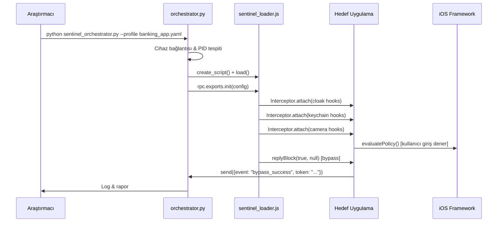

# 🏗️ Sentinel Hook — Proje Mimarisi & Modül Haritası

> **Sürüm:** Phase 7.3 Stable  
> **Durum:** Aktif Geliştirme  
> **Platform:** iOS 14–18 · Android (AOSP 10–14)

---

## 1. Genel Bakış

Sentinel Hook, mobil uygulamaların biyometrik doğrulama ve kamera sensörü katmanlarını **Frida tabanlı dinamik enstrümantasyon** ile analiz eden bir güvenlik araştırma çerçevesidir. Mimari üç ana katmandan oluşur:

```
┌─────────────────────────────────────────────────────────────┐
│                     ORCHESTRATION (Python)                   │
│        sentinel_orchestrator.py  ·  rpc_bridge.py           │
└──────────────────────────┬──────────────────────────────────┘
                           │  RPC over USB / TCP (port 27042)
┌──────────────────────────▼──────────────────────────────────┐
│                   FRIDA AGENT (JavaScript)                   │
│   sentinel_loader.js  ─────►  hooks/ios/  ·  hooks/android/ │
└──────────────────────────┬──────────────────────────────────┘
                           │  Interceptor / Memory API
┌──────────────────────────▼──────────────────────────────────┐
│              TARGET APP (iOS / Android Process)              │
│    LocalAuthentication · AVFoundation · Security · Vision    │
└─────────────────────────────────────────────────────────────┘
```

---

## 2. Dizin Yapısı

```
sentinel-hook/
├── src/
│   ├── core/
│   │   ├── sentinel_orchestrator.py   # Ana Python kontrol döngüsü
│   │   ├── rpc_bridge.py              # Frida ↔ Python RPC köprüsü
│   │   └── session_manager.py         # Cihaz bağlantısı & oturum yönetimi
│   ├── hooks/
│   │   ├── ios/
│   │   │   ├── cloak.js               # Jailbreak / Anti-tamper bypass
│   │   │   ├── keychain.js            # Keychain & SecItem hooklama
│   │   │   └── camera.js             # AVFoundation frame enjeksiyonu
│   │   └── android/
│   │       ├── biometric.js           # BiometricPrompt bypass
│   │       └── camera.js              # Camera2 / CameraX enjeksiyonu
│   ├── payloads/
│   │   └── face_inject/               # Statik JPEG / video buffer payload'ları
│   ├── recon/
│   │   └── app_scanner.py             # IPA / APK yüzey keşfi
│   └── utils/
│       ├── smart_mapper.py            # Dinamik offset çözümleyici
│       └── safe_boot.js              # Hata yakalama & recovery wrapper
├── sentinel_loader.js                 # Frida agent ana giriş noktası
├── configs/
│   └── profiles/                     # Hedef uygulama profil YAML dosyaları
├── tools/
│   └── external/                     # Dış kaynaklı yardımcı araçlar
├── .local/
│   ├── apks/                         # Test APK'ları (git-ignored)
│   ├── ipas/                         # Test IPA'ları (git-ignored)
│   └── test-faces/                   # Replay-attack JPEG/MP4 dosyaları (git-ignored)
├── docs/                             # Teknik dokümantasyon (bu dizin)
├── tests/                            # Birim & entegrasyon testleri
├── install.sh                        # Ortam kurulum betiği
└── cleanup.sh                        # İz bırakmadan temizlik betiği
```

---

## 3. `sentinel_loader.js` — Frida Agent Giriş Noktası

`sentinel_loader.js`, Frida tarafından hedef process'e enjekte edilen ana JavaScript modülüdür. Sorumluluğu:

1. **Platform tespiti:** `ObjC.available` veya `Java.available` kontrolü ile iOS/Android ayrımı yapılır.
2. **Profil yükleme:** Python tarafından RPC aracılığıyla gönderilen konfigürasyon (hangi hook modülleri aktif, hangi payload kullanılacak) alınır.
3. **Modül yükleme ve sıralama:** Bağımlılık sırasına göre (`cloak` → `keychain` → `camera`) hook modülleri sırayla aktifleştirilir.
4. **RPC export tanımları:** Python orchestrator'ın çağırabileceği `rpc.exports` nesnesi kurulur.

```js
// sentinel_loader.js — Basitleştirilmiş akış
rpc.exports = {
  init(config) {
    if (ObjC.available) {
      require('./hooks/ios/cloak').attach(config);
      require('./hooks/ios/keychain').attach(config);
      if (config.cameraEnabled)
        require('./hooks/ios/camera').attach(config);
    }
  },
  getStatus() { /* Aktif hook listesi döndürür */ },
  teardown() { /* Tüm Interceptor'ları detach eder */ }
};
```

---

## 4. Modüller Arası İletişim

### 4.1 Frida ↔ Python RPC Köprüsü

```
Python                          Frida (JS)
  │                                │
  │──── session.create_script() ──►│
  │◄─── script.load()  ────────────│
  │                                │
  │──── script.exports.init(cfg) ──►│  [Mesaj: RPC Call]
  │◄─── rpc resolve: OK ───────────│
  │                                │
  │    ┌──── hook tetiklendi ───────│  [Mesaj: send()]
  │◄───┤  script.on('message', cb) │
  │    └────────────────────────── │
```

- **RPC Calls:** Python → JS yönünde senkron çağrılar. `session.rpc.exports.*` API'si kullanılır.
- **send() / message:** JS → Python yönünde asenkron olaylar. Hook tetiklendiğinde kamera frame'i, bypass başarısı gibi veriler Python'a iletilir.

### 4.2 Hook Modülleri Arası Bağımlılık

```
[cloak.js]          ─── Jailbreak tespitini gizler
     │
     └──► [keychain.js]   ─── Keychain okumaları yakalanır
               │
               └──► [camera.js]   ─── Frame stream manipüle edilir
```

`cloak.js` her zaman önce yüklenir; `stat64`, `access`, `fork` gibi anti-tamper syscall'ları devre dışı bırakılmadan `keychain.js` ve `camera.js` güvenli çalışamaz.

---

## 5. Python Orchestration Katmanı

`sentinel_orchestrator.py` ana döngüsü:

```
1. Cihaz bağlantısı (USB / TCP)      [session_manager.py]
2. Hedef app PID tespiti              [frida.get_usb_device().attach()]
3. Profil yükleme (YAML)              [configs/profiles/]
4. Frida script enjeksiyonu           [sentinel_loader.js]
5. RPC init() çağrısı                 [konfigürasyon gönderimi]
6. Event loop (mesaj dinleme)         [on_message() callback]
7. Payload tetikleme (gerekirse)      [rpc.exports.inject_frame()]
8. Teardown & cleanup                 [rpc.exports.teardown()]
```

---

## 6. Orkestrasyon Şeması (Tam Akış)



---

## 7. Güvenlik ve İzolasyon

| Katman | Teknik | Amaç |
|:-------|:-------|:-----|
| Host İzolasyon | `.venv` + `node_modules` | Global sistem kirletilmez |
| Container | Docker (non-root, least-privilege) | Sandbox ortamı |
| Temizlik | `cleanup.sh` | Sıfır iz, RAM + disk temizliği |
| CI/CD | GitHub Actions + TruffleHog | Secret leak önleme |
| Ağ | Frida port 27042, sadece localhost | Dışarıya açık değil |

---

*Bkz: [`HOOK_REFERENCE.md`](HOOK_REFERENCE.md) · [`API_SURFACE.md`](API_SURFACE.md) · [`TROUBLESHOOTING.md`](TROUBLESHOOTING.md)*
