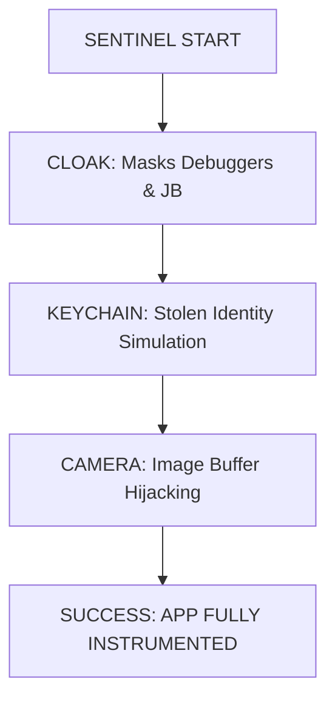

# 🧭 SENTINEL: THE FULL TACTICAL MANUAL


## 🎯 What is Sentinel?
Sentinel is a **world-class iOS Instrumentation Framework**. It doesn't just "break" biometrics—it hijacks the entire app lifecycle to make it think it's running on a clean, high-end iPhone for a verified user.

---

### **🧱 The Tactical Stack (Why It's Special)**
Sentinel uses a **Layered Injection** strategy. Here is the operational order:



---

## 🛠️ Customizing Your Mission

Every "Infiltrator" has different needs. Here is how you can customize Sentinel:

### **1️⃣  Target a Different App**
To target an app other than `DummyBank`, open **Terminal** and find its ID:
```bash
frida-ps -Uai | grep -i [AppName]
```
Then, go to `tests/v8_suite/test_suite_v8.py` and replace the `bundle_id`:
```python
bundle_id = "com.your.app.here" 
```

### **2️⃣  Change Your Identity (Spoofing)**
Want to look like an iPhone 14 or 13? Open `src/hooks/ios/cloak_hook.js` and change the `spoofedModel`:
```javascript
const CloakConfig = {
  spoofedModel: "iPhone 13", // Change this!
  spoofedSystemVersion: "16.0" 
};
```

### **3️⃣  Inject Your Own Photos**
Put your photo in the `.local/test-faces/` folder. Name it `target.jpg`.
Then, in `src/hooks/ios/camera_hook.js`, change the path:
```javascript
const CameraHookConfig = {
  imagePath: "/Users/[YourName]/Desktop/.../target.jpg"
};
```

---

## 🆘 Troubleshooting: The Wall of Solutions

> [!NOTE]
> **"TypeError: not a function"** — *What to do?*
> This is usually a framework loading issue in the Simulator. We already fixed this with our **Smart Mapping** tech! Just make sure your Simulator is properly booted.

> [!IMPORTANT]
> **"PermissionDeniedError"** — *What to do?*
> Sentinel cannot target **System Apps** (like Settings or Photos) on some Simulators due to Apple's security. **Always target 3rd party apps** like `DummyBank`.

> [!CAUTION]
> **"Unable to find method 'ping'"** — *What to do?*
> This means your JavaScript crashed at startup. Usually because your `imagePath` for the camera is wrong. Double-check your paths!

---

## 🚀 Final Tactical Advice
Always run the **Success Audit** after you start:
```bash
python3 -m pytest tests/v8_suite/test_suite_v8.py -v -s
```
If you see **3 PASSED**, you're in.

---
*Manual Version 8.12 — Built for Professionals, Accessible to Everyone*
