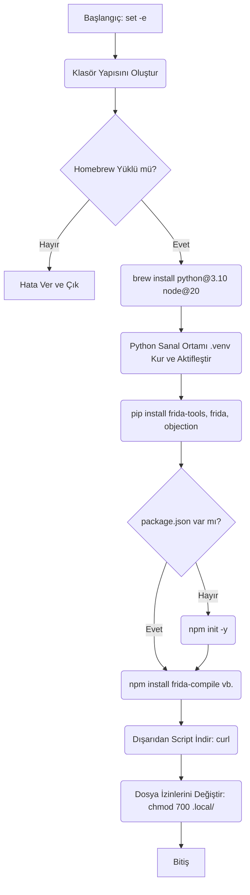

# 🛡️ Sentinel Hook - install.sh Güvenlik Analizi (Audit Raporu)
> Phase 0.0 - Adım 1 Çıktısı

## 1. Betiğin Genel Amacı ve Akışı
Bu betik (`install.sh`), Sentinel Hook projesinin geliştirme ortamını kurmak için hazırlanmış bir başlatma aracıdır. Temel olarak şu işlemleri sırasıyla gerçekleştirir:
1. Gerekli klasör yapısını oluşturur.
2. Sisteme sistem genelinde gerekli olan paketleri (Python 3.10, Node.js) kurar.
3. İzole bir Python sanal ortamı (`.venv`) kurar ve Frida araçlarını indirip içine kurar.
4. NPM projesi başlatıp Frida scriptlerini derlemek için gerekli npm paketlerini (`frida-compile`, `@types/frida-gum`) indirir.
5. Dış kaynaklı yardımcı scriptleri indirir.

### Akış Diyagramı


## 2. Detaylı Satır Satır Analiz

### Oluşturulan Dizinler:
Komut: `mkdir -p src/{hooks/{ios,android},payloads,utils,recon,core} docs/{...} tests/{...} configs/profiles tools .local/{apks,test-faces,ipas}`
- Projenin modüler mimarisini inşa eder. Sorunsuzdur.

### İstenen Sistem Yetkileri:
- Betiğin kendisi doğrudan `sudo` istemez.
- Ancak `brew install python@3.10 node@20` Homebrew üzerinden çalışır. Homebrew kurulum yaparken arka planda izinleri yönetir.
- Betiğin sonunda `chmod 700 .local/` çalıştırılarak `.local` dizini sadece geçerli kullanıcıya özel hale getirilir.

### Kurulan Ortam Değişkenleri ve Servisler:
- Herhangi bir ortam değişkenini `~/.bashrc` veya `~/.zshrc`'ye kalıcı olarak kaydetmiyor.
- `source .venv/bin/activate` ile yalnızca o anki shell oturumunda sanal ortam ortam değişkenlerini ayarlar (PATH vs.).
- Herhangi bir port açılmaz veya arka plan servisi (daemon) **başlatılmaz**.

## 3. Dışarıdan Çekilen Kaynaklar ve Güvenlik/Supply-Chain Analizi

### Çekilen Kaynaklar:
1. Homebrew paketleri: `python@3.10`, `node@20`
2. PyPI paketleri (pip): `frida-tools==16.2.1`, `frida==16.2.1`, `objection`
3. NPM paketleri: `frida-compile`, `@types/frida-gum`
4. Doğrudan Ağ İsteği (cURL): `curl -sL https://raw.githubusercontent.com/frida/frida/main/README.md`

### KRİTİK SORU: İndirilen kaynaklar ne kadar güvenli? İmza/Hash kontrolü var mı?

**Durum Değerlendirmesi:** Kötü (Zafiyetli)

**Nedeni / Tedarik Zinciri Saldırısı (Supply Chain Attack) Riski:**
- **Pinlenmiş Sürümler:** Script `FRIDA_VERSION` değişkeni ile PyPI'dan belirli bir sürüm (`16.2.1`) çekiyor. Bu iyi bir pratiktir.
- **EKSİK Hash Kontrolleri:** Pip kurulumlarında *hash doğrulama (hash-checking)* kullanılmamaktadır (örnek: `pip install --require-hashes -r requirements.txt`). Eğer saldırgan PyPI sunucularını veya DNS'i ele geçirirse, zararlı bir `frida-tools` paketi indirebilir.
- **EKSİK curl Kontrolleri:** `curl` ile çekilen dosyalarda hiçbir bütünlük veya hash kontrolü yapılmıyor. İndirilen şeyin gerçekten orijinal olduğunun bir garantisi yok. `curl | bash` mantığı ile betik çalışmaya oldukça elverişli tehlikeli bir ortam var. Yalnızca HTTPS kullanılıyor olması MitM (ortadaki adam) saldırılarını engellese de kaynak sunucunun ele geçirilmesine veya repository sahibinin (burada GitHub) zararlı kod push'lamasına karşı koruma sağlamaz.

## 4. Risk Tablosu

| Tehdit / Risk Sınıfı | Kaynak | Etki | Risk Seviyesi | Olasılık |
| :--- | :--- | :--- | :--- | :--- |
| **Tedarik Zinciri (Supply Chain)** | `pip install` (Hash doğrulaması yok) | Zararlı kodun host makinede çalışması (ACE) | 🔴 YÜKSEK | Orta |
| **Bütünlük Bozulması** | `curl -sL <url>` (İmza/Hash yok) | Zararlı/Değiştirilmiş dosya/script inmesi | 🔴 YÜKSEK | Orta |
| **Sistem Bütünlüğü** | `chmod 700 .local/` | Diğer sistem kullanıcılarının erişiminin engellenmesi (Proje için uygun, sorun değil) | 🟢 DÜŞÜK | Yüksek |

## 5. Önerilen İyileştirmeler (Hardening)

1. **GPG veya SHA256 Hash Doğrulaması Ekleyin:**
    - `curl` ile indirilen tüm dış script ve binary dosyaları için indirme sonrası hemen indirme bütünlüğünü kontrol etmek için kod ekleyin:
      ```bash
      EXPECTED_HASH="a1b2c3d4..."
      ACTUAL_HASH=$(shasum -a 256 tools/external/frida_readme.md | awk '{print $1}')
      if [ "$EXPECTED_HASH" != "$ACTUAL_HASH" ]; then echo "HASH MISMATCH"; exit 1; fi
      ```
2. **Pip gereksinimlerini şifreleyin:** Requirements dosyasını oluşturun ve `pip install --require-hashes -r requirements.txt` komutuyla checksum temelli kurulum kullanın.
3. `set -u` (kullanılmayan değişkenler tespit edilirse betiği durdur), `set -o pipefail` (pipeli komutların ortasındaki hataları yakala) ekleyin.
