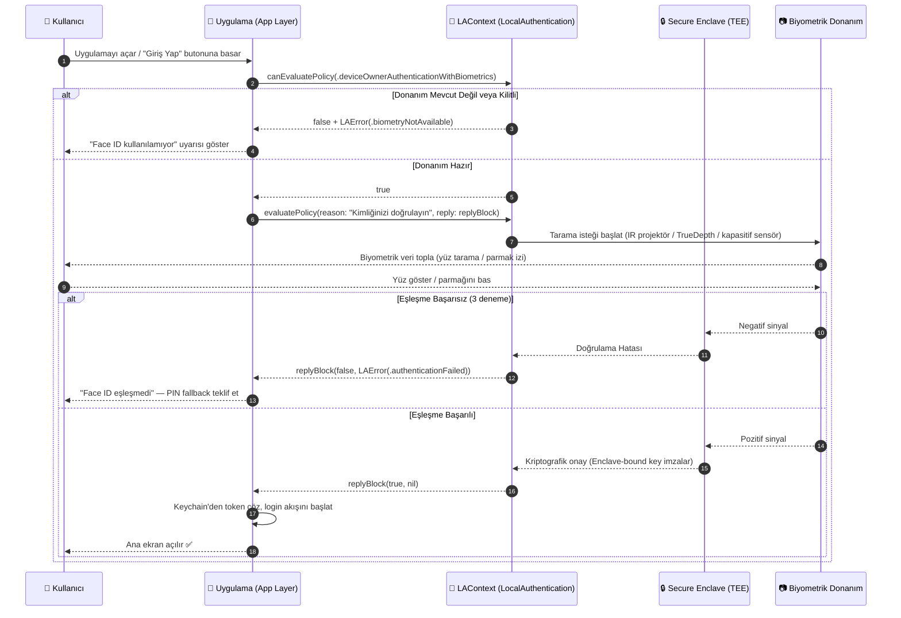
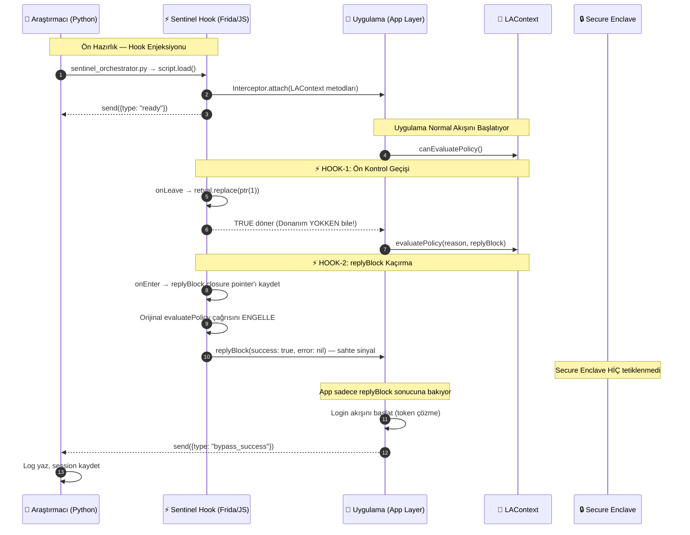
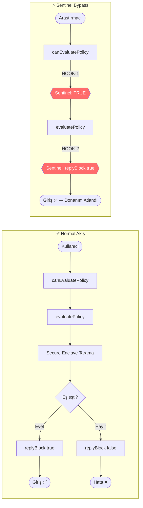
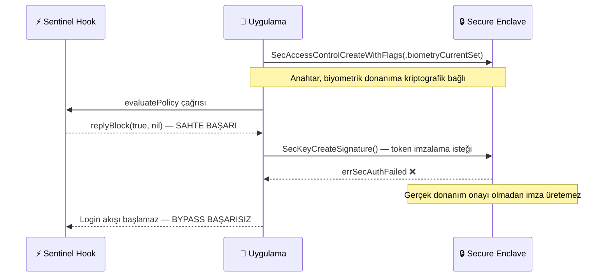

# 🔐 Auth Bypass Logic — Biyometrik Doğrulama Akışı

> **Phase 9.2 — Akış Diyagramları**  
> **Konu:** Normal Biyometrik Doğrulama vs. Sentinel Hook Bypass  
> **İlgili Modül:** `hooks/ios/keychain.js`, `LAContext`  
> **Önceki Referans:** `biometric-auth-flow.md` (Phase 1.3)

---

## 1. Normal Akış — Donanım Tabanlı Doğrulama

Kullanıcının herhangi bir müdahale olmaksızın Face ID / Touch ID ile uygulamaya girdiği standart akış. Her katmanın kendi sorumluluğu vardır ve zincirin herhangi bir halkası kırılırsa giriş reddedilir.

---

## 2. Sentinel Hook Bypass — Tam Yol Haritası

Frida enjeksiyonu sonrası Sentinel'in her iki kontrol noktasını (`canEvaluatePolicy` + `replyBlock`) nasıl ele geçirdiği. Donanım **hiç tetiklenmez**.

---

## 3. Karşılaştırma: Normal vs. Bypass

---

## 4. Neden CryptoObject Bypass'ı Engeller?

Eğer uygulama `replyBlock` yerine **Enclave-Bound Key** kullanıyorsa bypass başarısız olur:

> **Savunma notu:** `kSecAccessControlBiometryCurrentSet` + `CryptoObject` kombinasyonu, `replyBlock` manipülasyonunu işlevsiz kılar. Bkz. `HOOK_REFERENCE.md § Keychain — Biyometrik Bağlı Anahtar`.

---

*Bkz: [`camera-injection-pipeline.md`](camera-injection-pipeline.md) · [`hook-loading-sequence.md`](hook-loading-sequence.md) · [`HOOK_REFERENCE.md`](../HOOK_REFERENCE.md)*
