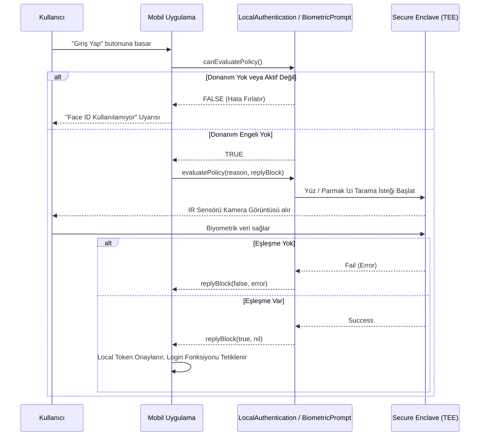
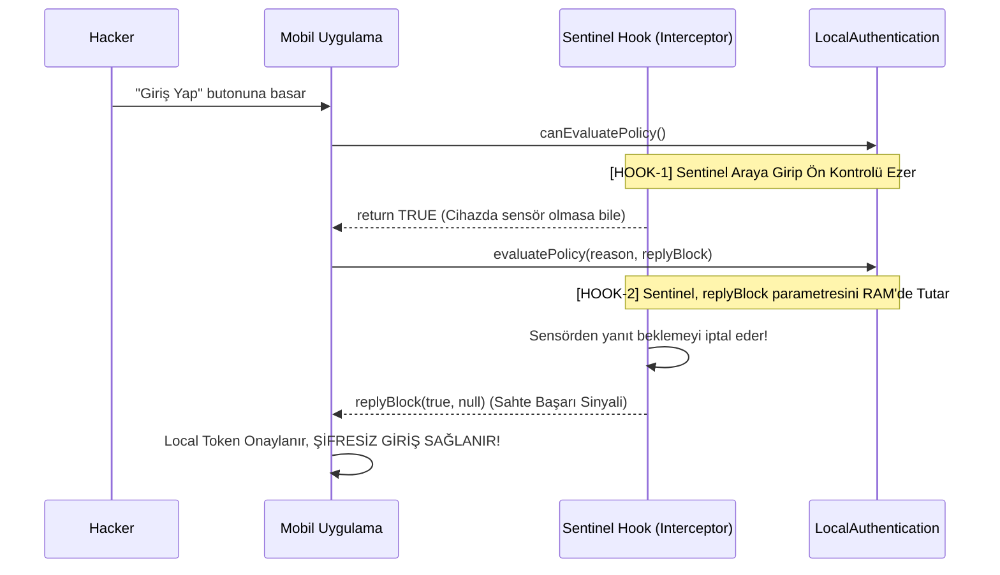

# 🔄 Biyometrik Doğrulama Akış Diyagramı (iOS ve Android Olguları)
> Phase 1.3 Çıktısı

Hedef bir bankacılık veya kilit uygulamasının biyometrik koruma altyapısını ve bizim Sentinel Hook ile bu mekanizmaya hangi noktalardan saldırdığımızı gösteren akış haritasıdır.

## 1. Uygulama İçi (Standart) Akış Şeması
Standart bir mobil uygulamanın cihazdaki biyometrik sensör ile nasıl konuştuğunu gösteren Mermaid diyagramı:

## 2. Sentinel Hook Bypass Akış Şeması
Sentinel Hook olarak bizim sisteme dışarıdan (Frida ile) dahil olup hem Ön-kontrolü (`canEvaluatePolicy`) hem de asıl blok fonksiyonunu (`evaluatePolicy`) nasıl kısa devre kıldığımızın algoritmasıdır:

## 3. Güvenlik Notları (Mitigation)
- `replyBlock` doğrudan boolean döndürdüğü için Frida ile %100 manipüle edilebilmektedir. 
- Eğer geliştirici yalnızca `replyBlock == true` kısmına bakmak yerine, `SecAccessControlCreateWithFlags` ve `CryptoObject` kullanarak uygulamanın private key'ini bu biyometrik sensör işlemine bağlasaydı, biz `true` döndürsek bile kriptografik imza üretilmeyeceği için Bypass başarısız olacaktı. 
