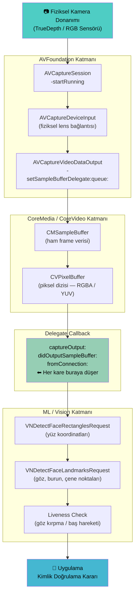
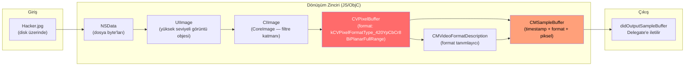
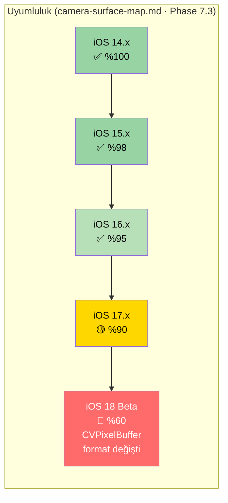

# 📷 Camera Injection Pipeline — Kamera Frame Manipülasyonu

> **Phase 9.2 — Akış Diyagramları**  
> **Konu:** AVFoundation Normal Frame Akışı vs. Sentinel Frame Enjeksiyonu  
> **İlgili Modül:** `hooks/ios/camera.js`  
> **Referans:** `api-maps/camera-surface-map.md` (Phase 1.4)

---

## 1. Normal Kamera Pipeline — Gerçek Frame Akışı

Bir liveness-check yapan uygulamanın sensörden ML katmanına kadar frame'i nasıl işlediği:



---

## 2. Sentinel Frame Enjeksiyon Pipeline

`camera.js` hook'u `didOutputSampleBuffer` noktasında devreye girerek gerçek frame'i düşürür ve `Hacker.jpg` piksel verisini uygulamaya "gerçek kameradan geliyormuş gibi" sunar:

```mermaid
graph TD
    HW["📷 Fiziksel Kamera Donanımı"]
    PY["🐍 Python Orchestrator\n(payload yolu RPC ile gönderilir)"]
    JPG["🖼️ Hacker.jpg\n(.local/test-faces/face.jpg)"]

    subgraph AVF["AVFoundation Katmanı — Değişmedi"]
        ACS["AVCaptureSession -startRunning"]
        ACO["AVCaptureVideoDataOutput\n-setSampleBufferDelegate:queue:"]
    end

    subgraph HOOK["⚡ Sentinel Hook — camera.js"]
        H1["HOOK-1: setSampleBufferDelegate\nDelegate pointer yakalandı\nQueue referansı saklandı"]
        H2["HOOK-2: didOutputSampleBuffer\nGerçek CMSampleBuffer DURDURULDU ❌"]
        H3["Payload Yükle:\nUIImage → CIImage → CVPixelBuffer"]
        H4["Sahte CMSampleBuffer Oluştur\n(orijinal timestamp korunur)"]
        H5["Sahte buffer, orijinal\nDelegate'e iletilir ✅"]
    end

    subgraph CM["CoreMedia / CoreVideo — Sahte Veri"]
        FVP["Fake CVPixelBuffer\n(Hacker.jpg piksel verisi)"]
        FSB["Fake CMSampleBuffer\n(gerçek timestamp + sahte piksel)"]
    end

    subgraph ML["ML / Vision Katmanı — Aldatıldı"]
        VNR["VNDetectFaceRectanglesRequest\nSahte yüz koordinatlarını alır"]
        LIV["Liveness Check\nSahte frame'de 'canlı yüz' bulur"]
    end

    APP["📱 Uygulama\n✅ Kimlik Doğrulandı"]

    HW -->|Gerçek frame| ACS --> ACO
    ACO --> H1 --> H2
    PY -->|rpc: inject_frame(path)| JPG --> H3 --> H4 --> FVP --> FSB --> H5
    H2 -.->|DROP| X["❌ Gerçek frame çöpe gider"]
    H5 --> VNR --> LIV --> APP

    style H2 fill:#ff6b6b,color:#fff
    style H3 fill:#ffa07a,color:#000
    style H4 fill:#ffa07a,color:#000
    style H5 fill:#98d4a3,color:#000
    style X fill:#ccc,color:#666,stroke-dasharray: 5 5
    style APP fill:#45b7d1,color:#000
```

---

## 3. CVPixelBuffer Dönüşüm Detayı

JPEG dosyasının `CMSampleBuffer`'a dönüştürülme adımları:



> **Kritik:** `CVPixelBuffer` formatı hedef uygulamanın beklentisiyle eşleşmezse `CVReturn -6680` hatası alınır.  
> Çözüm: Orijinal buffer'dan `CVPixelBufferGetPixelFormatType()` ile format alınıp aynısı kullanılır.  
> Bkz. `TROUBLESHOOTING.md § CVReturn error: -6680`.

---

## 4. iOS Sürümüne Göre Başarı Oranı



---

*Bkz: [`auth-bypass-logic.md`](auth-bypass-logic.md) · [`hook-loading-sequence.md`](hook-loading-sequence.md) · [`HOOK_REFERENCE.md`](../HOOK_REFERENCE.md)*
