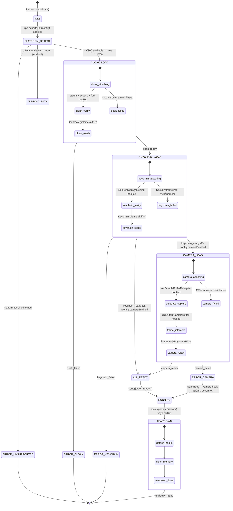
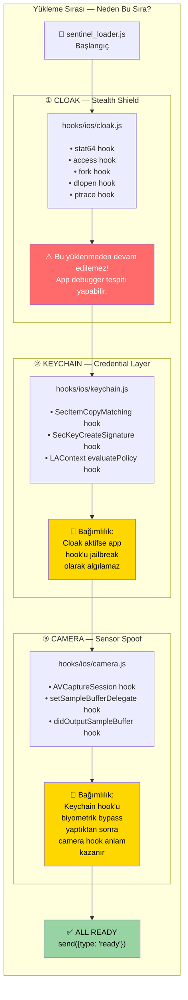
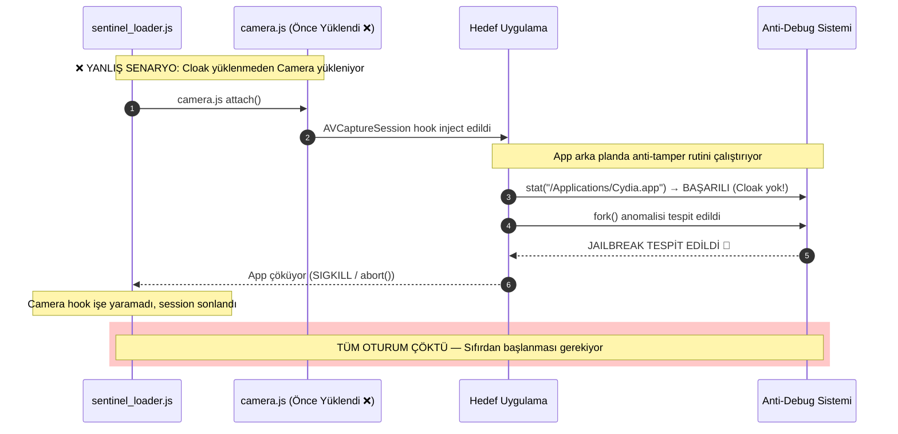
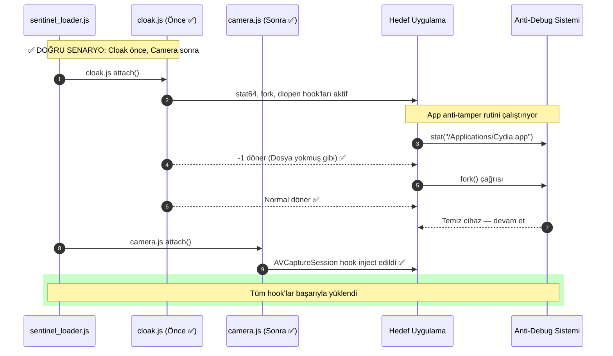
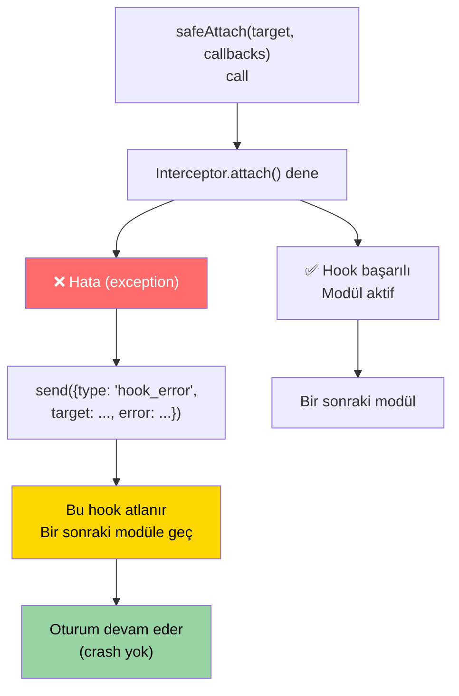

# ⚙️ Hook Loading Sequence — Yükleme Sırası & Bağımlılık Grafiği

> **Phase 9.2 — Akış Diyagramları**  
> **Konu:** `sentinel_loader.js` Başlatma Akışı — Neden Sıra Kritik?  
> **İlgili Modül:** `sentinel_loader.js`, `hooks/ios/cloak.js`  
> **Referans:** `ARCHITECTURE.md § Modüller Arası İletişim`

---

## 1. Yükleme Durumu Diyagramı

`sentinel_loader.js`'in başlatma anından tüm hook'ların aktifleşmesine kadar geçen durum makinesi:

---

## 2. Neden Sıra Kritik? — Bağımlılık Grafiği

---

## 3. Yanlış Sıra — Ne Olur?

---

## 4. Safe Boot Mekanizması

Bir modül yüklenemezse `safe_boot.js` zinciri kırılmadan devam eder:

> **Not:** `cloak.js` hatası tek istisnadır — Stealth Shield yüklenemezse oturum **her zaman** durdurulur. Diğer modül hataları Safe Boot ile atlanabilir.

---

## 5. Yükleme Sırası Özet Tablosu

| Sıra | Modül | Bağımlılık | Hata Davranışı |
|:----:|:------|:-----------|:---------------|
| ① | `cloak.js` | Yok — ilk her zaman bu | **FATAL** — oturum durdurulur |
| ② | `keychain.js` | Cloak aktif olmalı | Safe Boot — atlanır, devam |
| ③ | `camera.js` | Cloak + config.cameraEnabled | Safe Boot — atlanır, devam |

---

*Bkz: [`auth-bypass-logic.md`](auth-bypass-logic.md) · [`camera-injection-pipeline.md`](camera-injection-pipeline.md) · [`ARCHITECTURE.md`](../ARCHITECTURE.md)*
